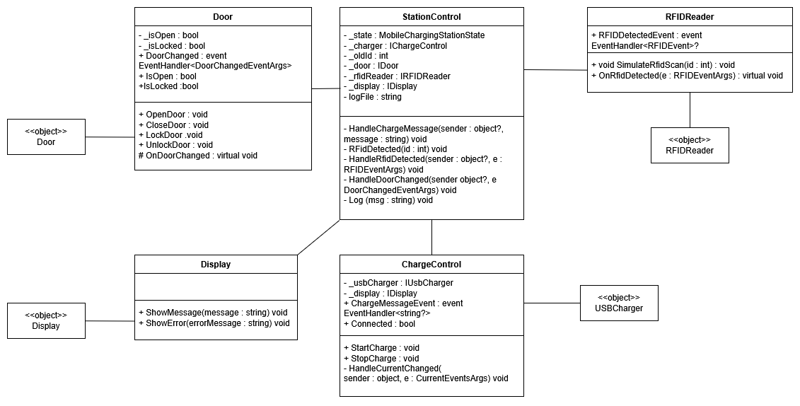
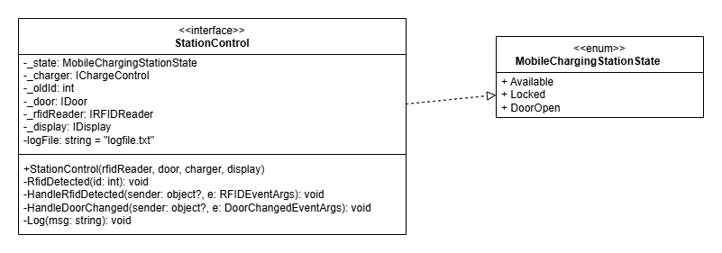
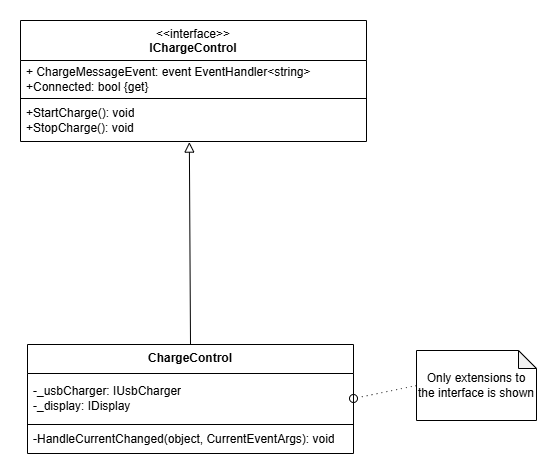
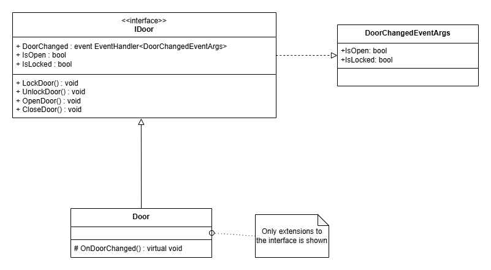
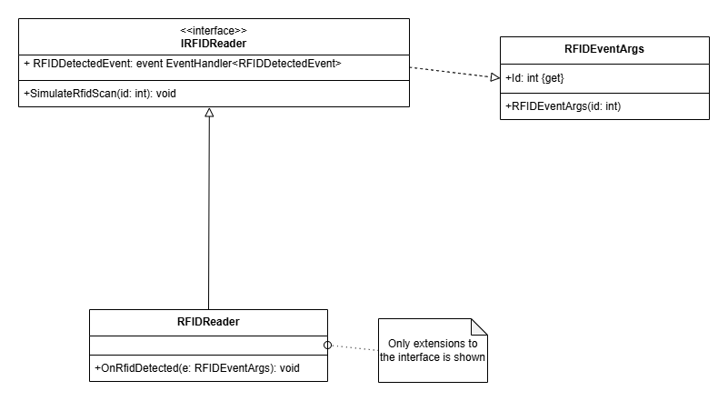
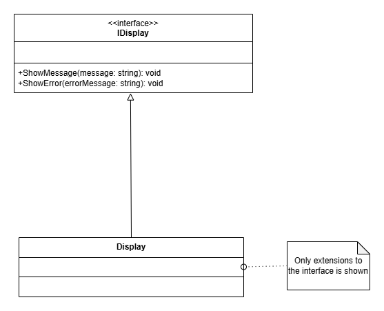
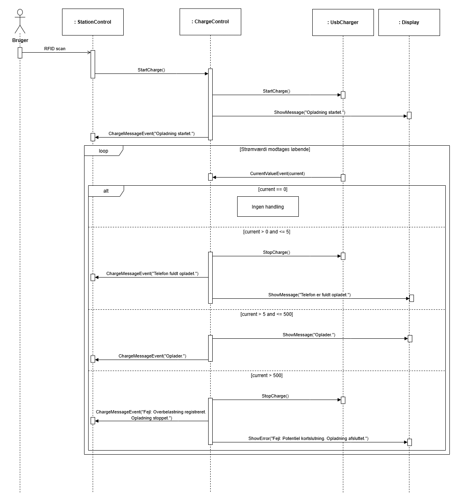
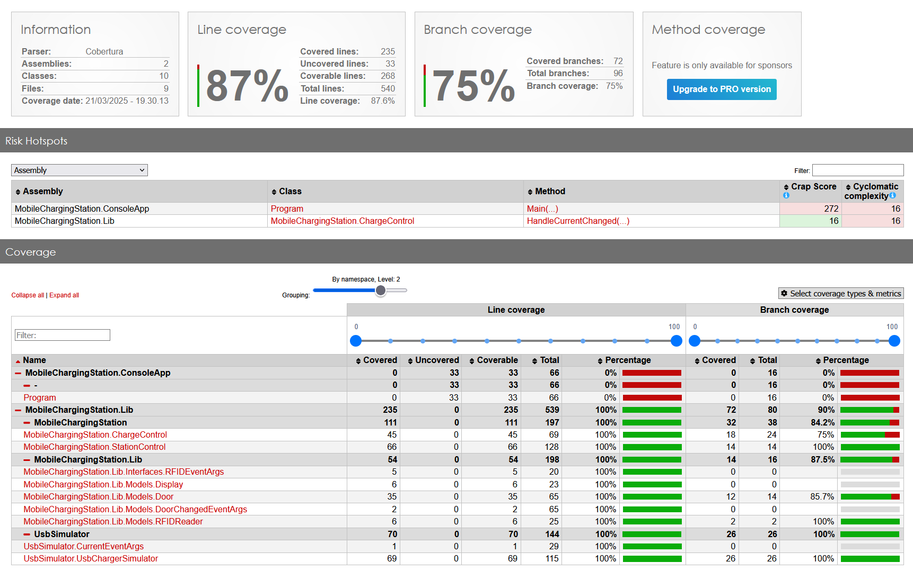

# Introduktion
Dette dokument beskriver udarbejdelsen af systemet MobileChargingStation som del af handin-2 i faget Software test.
Systemet er udviklet af gruppe 6 som består af:

| Name                   | Student Number |
|------------------------|----------------|
| Emil Holm Riis         | 202305265      |
| Andreas Gadgaard       | 202306990      |
| Jesper Lund Pedersen   | 202308221      |

#### Link til gruppens repository findes [HER](https://gitlab.au.dk/au724429/swt-group6-handin2)

## Formål
Denne opgave omhandler design, implementering og test af software til et ladeskab til mobiltelefoner, der er tiltænkt brug i omklædningsrum i eksempelvis svømmehaller. Formålet med systemet er at sikre en brugervenlig og sikker opladningsmulighed for mobiltelefoner, hvor brugeren anvender et RFID-tag til at låse og låse op for skabet. Systemet skal kunne registrere, hvornår opladningen er aktiv, hvornår den er færdig, samt håndtere eventuelle fejlsituationer.

## Krav
Systemet er udviklet i overensstemmelse med de krav, der er beskrevet i opgavebeskrivelsen for Handin 2. Dette inkluderer:

- Design og implementering af et software-system til styring af ladeskabet.
- Enheder som dørkontrol, RFID-læser, USB-oplader og display.
- En controllerklasse (StationControl), der håndterer systemets overordnede logik.
- En opladningscontroller (ChargeControl), der overvåger opladningsstatus og håndterer fejlsituationer.
- Logging af hændelser såsom låsning, oplåsning og fejltilstande.
- Implementering og test af systemet ved hjælp af unit tests.

## Arbejdsproces
Systemet er udviklet som en gruppeopgave med brug af et fælles Git-repository, hvor versionsstyring og samarbejde er håndteret via GitLab.

For at sikre kvaliteten af koden er Continuous Integration (CI) anvendt, hvilket betyder, at systemet automatisk bygges og testes ved hver commit. Dette har hjulpet med at identificere fejl tidligt i udviklingsprocessen og sikret, at koden overholder de opstillede kravspecifikationer.

# Design og implementering
I designet af vores system har vi haft fokus på løst koblede komponenter og deres testbarhed. Vi har valgt at anvende interfaces til design og events til kommunikation, så det er muligt for os at simulerer den ikke-eksisterende hardware i vores testmiljø. Ved at opdele systemet i mindre moduler har vi forsøgt at minimere afhængigheder, hvilket gør det lettere at teste og vedligeholde implementeringen af systemet. 

Til implementereing have vi anvendt events til at kommunikere imellem klasserne, og dette har gjort det muligt at teste klasserne individuelt. Vi har anvendt dependency injection til at injecte de nødvendige klasser ind i de klasser, der har brug for dem. Dette har gjort det muligt at teste klasserne med mock-objekter, hvilket gør det lettere at isolere de enkelte klasser og teste dem individuelt.

## Klasse diagrammer
I dette afsnit præsenteres alle klassediagrammerne i systemet, samt hvordan de interagerer med hinanden. Først tages der udgangspunkt i hele systemet, hvorefter klasserne beskrives yderligere i dem hvor der anvendes interfaces.

### Hele systemet
||
|:--:|
|*Figur 1: Overordnet klassediagram for hele systemet*|

Som det ses på figur 1, så er hele systemet opdelt i flere forskellige komponenteter, som hver især har et ansvar. Systemet består af følgende klasser

- StationControl: Ansvarlig for at styre systemets tilstande og reaktioner på eksterne inputs.
- ChargeControl: Håndtering af oplaadningsprocessen og reaktioner på strømændringer.
- Door: Håndtering af dørens tilstand og reaktioner på åbning, lukning og låsning.
- RFIDReader: Registrering af brugerens RFID.
- Display: Meddelelser til brugeren om systemets tilstand.
- UsbCharger: Simulering af en USB-oplader.

### StationControl
||
|:--:|
|*Figur 2: StationControl klassediagram*|

`StationControl` klassen er hovedcontrolleren, som er implementeret via. STM diagrammet som er givet i afleveringen. Den håndterer iteraktionen mellem vores andre komponenter `Door`, `RFIDReader`, `Chargecontrol` og `Display`. Der anvendes forskellige attributter som bl.a. holder styr på `Doors` aktuelle tilstand, og `RFIDReader` for håndtering af RFID-læsning. Dette gøres ved at lytte på events for ændringer på disse og agerer ud fra dem. Dette gør at den ikke er direkte afhængig af implementeringen af `Door` og `RFIDReader`. Derudover beslutter den hvornår `Door` skal låses og oplåses. Det er også `StationControl` som håndterer alt logging i systemet, ud fra de krav om logging af beskeder, som er stillet i opgaven. Den styrer også hvilke beskeder og mulige fejlbeskeder, som skal vises på Displayet til ladeskabet. Den lytter også på events fra `ChargeControl`, som beskriver om opladningen er startet, stoppet eller fejlet.

### ChargeControl
||
|:--:|
|*Figur 3: ChargeControl klassediagram*|

`ChargeControl` er ansvarlig for at styre opladningsprocessen. Den interagerer med `IUsbCharger` og `IDisplay`. Den lytter til strømændringer via `CurrentValueEvent` fra `IUsbCharger` og beslutter ud fra strømstyrken, om opladningen skal fortsætte, afsluttes eller stoppes pga. fejl. Derudover anvendes observer-pattern til at notificere `StationControl` om opladningsstatus, via. eventet fra `IUsbCharger`.

Der anvendes mocks til at teste `ChargeControl`, så vi kan verificerer den forventelige adfærd, uden den ikke-eksisterende hardware komponenter. 

### Door
||
|:--:|
|*Figur 4: Door klassediagram*|

`Door` repræsenterer den fysiske låge og håndterer åbning/lukning samt lås/oplås. Den udsender `DoorChanged` events, som `StationControl` bruger til at holde styr på om døren er åben/lukket eller låst/ulåst.

### RFIDReader
||
|:--:|
|*Figur 5: RFIDReader klassediagram*|

Denne klasse simulerer aflæsning af et RFID-tag. Den udsender et event `RFIDDetectedEvent` med det aflæste ID, som `StationControl` abonnerer på.

### Display
||
|:--:|
|*Figur 6: Display klassediagram*|

Som ses på figur 6, er `Display` en simpel klasse, der implementerer `IDisplay`. Da den ikke har extensions, er den ikke vist på figur 6.

`Display` fungerer som en UI-komponent (konsol-output) og giver brugeren information om systemets tilstand. Den bruges af både `StationControl` og `ChargeControl`.

## Sekvensdiagram for Opladningsprocessen

Til opgaven udviklede vi et sekvensdiagram, der illustrerer interaktionen mellem systemets nøglekomponenter under en opladningssession. Dette diagram, fremstillet i Figur 7, detaljerer kommunikationen mellem `StationControl`, `ChargeControl`, `UsbCharger`, og `Display`, fra det øjeblik en bruger initierer opladning ved at forbinde sin telefon og scanne et RFID-tag.

||
|:--:|
|*Figur 7: Opladning sekvensdiagram*|

Opladningsprocessen indledes, når `StationControl` modtager input fra brugeren og instruerer `ChargeControl` om at starte opladningen. `ChargeControl` anmoder herefter `UsbCharger` om at aktivere opladningsfunktionen og beder samtidig `Display` om at informere brugeren med en besked om, at opladningen er startet.

Under opladningen overvåger `UsbCharger` strømstyrken og rapporterer løbende tilbage til `ChargeControl` via `CurrentValueEvent`. Afhængigt af den rapporterede strømstyrke reagerer `ChargeControl` som følger:

|**Målt ladestrøm** |**Betydning** |
| - | - |
|0 mA |Der er ingen forbindelse til en telefon, eller ladning er ikke startet. Displayet viser ikke noget om ladning. |
|0 mA < ladestrøm ≤ 5 mA |Opladningen er tilendebragt, og USB ladningen **kan stoppes**. Displayet viser, at telefonen er fuldt opladet. |
|5 mA < ladestrøm  ≤ 500 mA |Opladningen foregår normalt. Displayet viser, at ladning foregår. |
|ladestrøm > 500 mA |Der er noget galt, fx en kortslutning. USB ladningen **skal straks stoppes**. Displayet viser en fejlmeddelelse. |

Diagrammet fremhæver, hvordan systemet håndterer strømændringer sikkert og sikrer, at opladningen altid foregår under kontrollerede forhold, samtidig med at brugeren kontinuerligt holdes informeret om opladningens status.

# Refleksion af Design
I opgavebeskrivelsen blev der nævnt, at "events are your friends." Dette råd har vi fulgt ved at implementere events i flere af vores klasser, som er en central del af *Observer Pattern* designmønsteret. Dette mønster har været afgørende for at reducere koblingen mellem komponenter, hvilket har gjort det nemmere at foretage ændringer i en komponent uden at påvirke andre dele af systemet. Denne tilgang har forbedret systemets modularitet markant.

**Fordel:** Modulariteten forbedrer systemets vedligeholdelse og udvidelsesmuligheder, da ændringer i en komponent sjældent kræver ændringer i andre dele af systemet. **Ulempe:** Overdreven brug af events kan gøre flowet i kodebasen mindre gennemsigtigt, hvilket potentielt kan komplicere fejlfinding og forståelsen af data flow.

Brugen af interfaces har ligeledes spillet en væsentlig rolle i at afkoble komponenterne. Det har været yderst fordelagtigt at kunne kalde metoder defineret i et interface uden nødvendigvis at have fuldstændige implementeringer, hvilket har muliggjort en mere fleksibel arbejdsdeling og tidlig integration i udviklingsprocessen.

**Fordel:** Interfaces understøtter udskiftelighed og testbarhed ved at tillade mock-implementeringer under test, hvilket forbedrer testdækningen og reducerer risikoen for fejl i produktion. **Ulempe:** Kravet om at vedligeholde interface-definitioner kan øge den indledende udviklingstid og tilføje kompleksitet, når mange komponenter afhænger af fælles interfaces.

Specifikt har brugen af interfaces gjort det muligt at anvende mocks under testningen af vores `ChargeControl`-klasse. Dette har befriet os fra bekymringer om de afhængigheder, som `ChargeControl` interagerer med, hvilket har forbedret fokuset og kvaliteten af vores tests. Der kan argumenteres for at vi også skulle have brugt mocks til test af `StationControl`-klassen, men vi valgte ikke at bruge mocks til at teste `StationControl`-klassen, da dette valg gav os mulighed for at teste klassen i et mere integreret og realistisk miljø, hvor de faktiske interaktioner mellem afhængighederne kunne verificeres. Denne beslutning støttede en dybere verifikation af systemintegrationen, selvom det kompromitterede isolationsniveauet i testene.

**Fordel:** Ved at teste i et realistisk miljø blev vi bedre i stand til at identificere og rette fejl, der kun viser sig under faktiske brugsforhold. **Ulempe:** Dette kompromis med isolationsniveauet kan gøre det vanskeligt at pinpointe specifikke fejlårsager, da tests ikke er fuldstændigt isolerede.

Samlet set har disse arkitektoniske og designmæssige beslutninger styrket både udviklingsprocessen og produktets testbarhed, selvom nogle af beslutningerne har medført kompromisser i forhold til kodebasens kompleksitet og teststrategi.

# Refleksion af arbejdsfordeling og CI
I gruppen har vi anvendt et fælles git-repository til at dele og organisere vores opgaver. Dette har muliggjort en effektiv arbejdsdeling, hvor vi har kunnet arbejde parallelt uden større konflikter.

### Fordeling af opgaver
Vi startede med at udarbejde sekvens- og klassediagrammer sammen, hvilket sikrede en fælles forståelse for systemets struktur og interaktioner mellem komponenterne. Dette faciliterede en mere smidig opdeling af opgaver, da hver gruppe medlem var klar over systemets samlede funktionalitet og ansvarsområder. Efterfølgende blev klasserne opdelt, så hver især kunne implementere og teste deres del uafhængigt. Vi anvendte Moq-biblioteket til at isolere klasserne under test, hvilket gjorde det muligt at simulere afhængigheder og undgå fejlpropagering mellem klasserne.

Det var gavnligt for projektets fremdrift at opdele opgaverne, da det reducerede bottlenecks og forbedrede læringen, idet hver deltager fik hands-on erfaring med systemet. Kontinuerlig kommunikation blev opretholdt gennem fysisk samarbejde i samme lokale eller via gruppeopkald, hvilket var essentielt for at synkronisere interface-aftaler og metodenavne mellem de interagerende klasser.

### CI
Brugen af Continuous Integration (CI) har spillet en central rolle i vores udviklingsproces, især fordi vi arbejdede på forskellige dele af koden og regelmæssigt mergede vores ændringer til det samme repository. I projektets start stødte vi på udfordringer, hvor ufuldstændig eller fejlfyldt kode blev pushet, hvilket midlertidigt forhindrede testing og videreudvikling. For at adressere dette problem, indførte vi en praksis med at køre alle tests før et push til repository, hvilket sikrede, at kun funktionel kode blev integreret.

||
|:--:|
|*Figur 7: Coverage Report*|

Som en integreret del af vores CI-proces har vi implementeret en detaljeret coverage report, der viser effektiviteten af vores teststrategi. Rapporten viser, at vi har opnået 100% line coverage for alle klasser undtagen `Program.cs`, som vi ikke har inkluderet i vores test scope. Dette skyldes, at `Program.cs` primært håndterer opstartsprocedurer, der ikke let lader sig teste automatisk. Selvom den samlede coverage vises som 87%, dækker resten af kodebasen faktisk 100%, hvilket understreger dybden af vores testindsats.

Ved hjælp af en foruddefineret `.git-ci.yaml` fil har vi automatiseret test- og build-processen, hvilket har hjulpet os med hurtigt at identificere og adressere fejl. Dette setup har også gjort det nemt at spore fejl til specifikke commits og, hvis nødvendigt, rulle tilbage til en tidligere stabil version af koden.

# Konklusion
Opgaven MobileChargingStation har givet værdifuld læring til hele gruppen. Vi har udviklet et funktionelt system til sikker og brugervenlig opladning af mobiltelefoner i offentlige rum. Ved hjælp af designprincipper som løs kobling og anvendelse af Observer Pattern har vi skabt en robust og testbar softwareløsning, der opfylder de opstillede krav i opgavebeskrivelsen.

### Opnåede Resultater
- Vi har succesfuldt implementeret et system, hvor alle nødvendige funktioner er testet og verificeret gennem et omfattende sæt af unit tests, hvilket sikrer systemets pålidelighed og stabilitet.
- Brugen af Continuous Integration (CI) har været afgørende for at opretholde høj kodekvalitet og har gjort det muligt at fange og rette fejl tidligt i udviklingscyklussen.
- Samarbejdet i gruppen har været effektivt med klare kommunikationslinjer og en velorganiseret arbejdsfordeling, hvilket har bidraget til en glat udviklingsproces.

### Læringer
- Gennem denne opgave har vi opnået en dybere forståelse for vigtigheden af softwarearkitektur og designmønstre i udviklingen af testbare og vedligeholdelsesvenlige systemer.
- Vi har forbedret vores kendskab til interfaces og deres anvendelse i softwaresystemer, hvor afkobling og modularitet er prioriteret.
- Vi har også lært at navigere i kompleksiteterne ved teamarbejde, hvor tæt samarbejde og klare aftaler er nødvendige for at sikre, at alle komponenter fungerer sammen som en helhed.

Afslutningsvis har opgaven MobileChargingStation ikke alene levet op til de tekniske specifikationer, men også væsentligt forbedret vores kompetencer inden for softwareudvikling og samarbejde. Disse færdigheder vil utvivlsomt være af stor værdi i vores fremtidige uddannelsesmæssige og professionelle projekter.